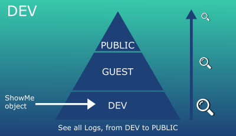

# ShowMe library 
 


# About
This is a small logger but with powerful resources, extensible API which provides utility on top of Android's normal Log class.

You can control who can see your logs with **WatcherType** and use **LogTypes** with special chars to enhance your Log Reading.

You can also use **Design By Contract**, Summary and store your logs in local file.

# Dependency

In build.graddle (Project)
```kotlin
  allprojects {
    repositories {
        google()
        jcenter()
        maven { url 'https://jitpack.io' }
    }
  }
```

    
In build.graddle (app)
```kotlin
dependencies {
implementation 'com.github.3xcool:showme:0.0.1'
}
```

# Before we start, let’s learn some concepts first.

## Watcher Types

The main goal of this library is to control your log access, who can see and which type of logs may be shown in different scenarios.

For example, you develop a library that will be used by another developer. 
There might be some logs that you do not want anyone else to see, for that we have the WatcherType (DEV, GUEST, PUBLIC) provided by an enum Class.

```kotlin
enum class WatcherType(val type: Int) {
    DEV(0),         //only developer can see
    GUEST(1),       //only developer and guest can see
    PUBLIC(2)       //anyone can see
}
```

### Example:
During development phase:
1. Instantiate a showMe object:

```kotlin
var mShowMeDev = ShowMe(true, "Sample-Dev", WatcherType.DEV.type)
//true = activate logs
//“Sample-Dev” = prefix for your logs
//WatcherType.DEV = DEV, GUEST and PUBLIC logs will be shown
```

2. When writing your log, pass DEV type for watcher:

```kotlin
mShowMeDev.d(“this is a private log, only dev can see”, WatcherType.DEV.type)
```

Please see below a snapshot of current status:




During deployment (sending your lib to another dev), just change watcherType in step 1:

```kotlin
var mShowMeDev = ShowMe(true, "Sample-Dev", WatcherType.GUEST.type)
```

Now our current status is:


Only **GUEST** and **PUBLIC** logs will be shown.

Or you can simply disable all your Logs by setting **false** to the first parameter.

```kotlin
var mShowMeDev = ShowMe(false, "Sample-Dev", WatcherType.DEV.type)
```

## Log Types
To enhance readability we have the Logtypes provided by an enum Class:

```kotlin
enum class LogType(val type: Int) {
    ALL(7),
    SUCCESS(6),
    ERROR(5),
    WARNING(4),
    INFO(3),
    EVENT(2),
    DETAIL(1),
    DEBUG(0)
}
```

Just like **WatcherType**, you can control which log to show when setting logType value in showMe object.

Example:
1. Instantiate a showMe object:

```kotlin
var mShowMeDev = ShowMe(true, "Only-warnings and above", LogType.WARNING.type)
//true = activate logs
//LogType.Warning.type = Warning, Error, Success and ALL logs will be shown.
```

2. When writting your log, pass logType value:

```kotlin
mShowMeDev.d(“this is an error message”, LogType.ERROR.type) //will be shown
mShowMeDev.d(“this is an event message”, LogType.EVENT.type) //will not be shown
```

See below our current status:


During development will be wisely to set LogType to **DEBUG** and WatcherType to **DEV** in order to see all your logs.
In production mode you can set to false (disable all logs) or choose **LogType = Warning** and **WatcherType = Public** for example, it’s up to you.


**For more detailed examples, please check ShowMeSampleAct.**

**Now let’s get a deep dive to all resources of this lib**.


# Create ShowMe object

```kotlin
var mShowMeDev = ShowMe(
mShowMeStatus: Boolean = true, 
mTAG: String = "ShowMe", 
mLogTypeMode: Int = LogType.DEBUG.type,
mWatcherTypeMode: Int = WatcherType.DEV.type, 
mShowTimeInterval: Boolean = false, 
mWriteLog: Boolean = false
)

/*
mShowMeStatus = show showMe logs, true if you want to show .
mTAG = add some text before your log message.
mLogTypeMode = Select your LogType Mode.
mWatcherTypeMode = Select your WatcherType Mode.
mShowTimeInterval = show time interval between logs with same ID.
mWriteLog = true if you want to store your log in local file. Important to injectContext() in order to use this feature.
*/
```

Example:

```kotlin
mShowMeDev = ShowMe(true, "Sample-Dev", LogType.DEBUG.type, WatcherType.DEV.type, mShowTimeInterval = true, mWriteLog = false)
```

# d() - Log Debug 

Main log method to show your debug log. 


```kotlin
mShowMeDev.d(
msg: String, 
logType: Int = defaultLogType, 
watcherType: Int = defaultWatcherType, 
addSummary: Boolean? = defaultAddSummary,
wrapMsg: Boolean? = defaultWrapMsg, 
logId: Int = 0
)

/*
msg = Log message;
logType = choose any logType or use the defaultLogType.
watcherType = choose any watcherType or use the defaultWatcherType.
addSummary = set true to add in summary (will also appears in showSummary call).
wrapMsg = wrap the message if needed.
logId = give an ID to your log in order to control time interval between logs.
*/
```

Example:

```kotlin
mShowMeDev.d(“My first ShowMe log”)    //using default values
mShowMeDev.d(“Only dev can see this error”, LogType.ERROR.type, WatcherType.DEV.type) 
```

**For more examples, please check ShowMeSampleAct activity.**

# title()

To increase readability add some title to your logs.

```kotlin
mShowMeDev.title("Some title", LogType.ALL.type, WatcherType.PUBLIC.type)
/*
===================
SOME TITLE
===================
*/
```
 
# dbc() - Design By Contract

Powerful way to check possible error during your business logic.

```kotlin
dbc(
rule: Boolean,
 msg: String, 
logType: Int? = LogType.ERROR.type,
watcherType: Int? = WatcherType.PUBLIC.type)

/*
rule = your business logic.
msg = prompt error message in case the rule is not satisfied (Contract is Broken)
Log and WatcherTypes default values are ERROR and PUBLIC but you can change this as well.
*/
```

Example:
```kotlin
dbc (a > b, "$a is not greater than $b")
```

# showSummary()

Will show all logs that have been added to summary.

```kotlin
showSummary(logCategory: Int = defaultLogType, watcherCategory: Int = defaultWatcherType) 
```


# skipLine()

skipLineQty = how many lines to skip
skipLineRepeatableChar = which char to repeat, default is “=”
skipLineRepeatableCharQty = how many repeatable char, default is 100.

# startLog()
clear mLogsId in order to restart time interval

# finishLog()
Clear mLogsId and summaryList

# Other self explanatory methods:

## enableShowMe()
Enable showMe at runtime

## disableShowMe()
Disable showMe at runtime.

## readLog()
Read the content stored in local file

## deleteLog()
Delete log local file

## getSpecialChars()
If you want to see alternative special chars to your logs.

## setDefaultCharsValue()
If you want to change log d() default values.

## setSkipLineDefaultValues()
If you want to change log skipLine() default values.

# License

Copyright 2019 André Filgueiras

Licensed under the Apache License, Version 2.0 (the "License");
you may not use this file except in compliance with the License.
You may obtain a copy of the License at

   http://www.apache.org/licenses/LICENSE-2.0

Unless required by applicable law or agreed to in writing, software
distributed under the License is distributed on an "AS IS" BASIS,
WITHOUT WARRANTIES OR CONDITIONS OF ANY KIND, either express or implied.
See the License for the specific language governing permissions and
limitations under the License.


