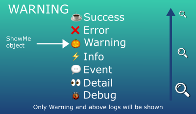

# ShowMe library 

[  ](https://bintray.com/3xcool/maven/com.3xcool.utility%3Ashowme/_latestVersion)

 


# About
This is a logger library that provides some utility features on top of Android's normal Log class.

You can control who can see your logs with **WatcherType** and use **LogTypes** with special chars to enhance your Log reading.

You can also use the concept of **Design By Contract** and **Summary**

Use **Fileman** library to store logs in a local file. 

Use **HTTP Sender** to send logs to a remote server (it's possible to add more than one sender). In the future we can add some other type of Senders like a toaster or notification. 

Fileman and HTTP Sender are using WorkManager with Coroutines under the hood to guarantee log chronology and to keep the job working even when the app is not running anymore.

You can control your logs with a powerful **Time Control**. There are 4 types of time: Current, Absolute, Relative and Relative by ID.

Use default Logcat types (Verbose, Debug, Info, Warning, Error) to enhance readability and add color control.

**Uncaught Error Handler (UEH)**: if the application crashes by some exception error like Null Pointer Exception, ShowMeUncaughtExceptionHandler class will store in a local file all the necessary and available information. If it's a throwing error, it will be possible to know the exact Class, Method and Line number. 


# Contents

- [ShowMe Log Sample](#showme-log-sample)
- [Readability](#readability)
- [Watcher Types](#watcher-types)
- [Log Types](#log-types)
- [Time Interval](#time-interval)
- [Implementation](#implementation)
- [Create ShowMe object](#create-showme-object)
- [Log Methods](#log-methods)
- [Fileman](#fileman)
- [HTTP Sender](#http-sender)
- [ShowMe Uncaught Exception Handler (UEH)](#showme-uncaught-exception-handler-ueh)


## ShowMe Log Sample

A small log example using ShowMe library.

 


## Readability
To enhance readability I've changed line space and Android Logcat colors.

 

 


## Watcher Types

The main goal of this library is to control your log access, who can see and which type of logs may be shown in different scenarios.

For example, you develop a library that will be used by another developer. 
There might be some logs that you do not want anyone else to see, for that we have the WatcherType (DEV, GUEST, PUBLIC) provided by an enum Class.

```kotlin
enum class WatcherType(val type: Int) {
    DEV(0),         //only developer can see
    GUEST(1),       //only developer and guest can see
    PUBLIC(2)       //anyone can see
}
```

### Example:
During development phase:
1. Instantiate a showMe object:

```kotlin
var mShowMeDev = ShowMe(true, "Sample-Dev", WatcherType.DEV.type)
//true = activate logs
//“Sample-Dev” = prefix for your logs
//WatcherType.DEV = DEV, GUEST and PUBLIC logs will be shown
```

2. When writing your log, pass DEV type for watcher:

```kotlin
mShowMeDev.d(“this is a private log, only dev can see”, WatcherType.DEV.type)
```

Please see below a snapshot of current status:


During deployment (sending your lib to another dev), just change watcherType in step 1:

```kotlin
var mShowMeDev = ShowMe(true, "Sample-Dev", WatcherType.GUEST.type)
```

Now our current status is:


Only **GUEST** and **PUBLIC** logs will be shown.

Or you can simply disable all your Logs by setting **false** to the first parameter.

```kotlin
var mShowMeDev = ShowMe(false, "Sample-Dev", WatcherType.DEV.type)
```

## Log Types
To enhance readability we have the Logtypes provided by an enum Class:

```kotlin
enum class LogType(val type: Int) {
    ALL(7),
    SUCCESS(6),
    ERROR(5),
    WARNING(4),
    INFO(3),
    EVENT(2),
    DETAIL(1),
    DEBUG(0)
}
```

Just like **WatcherType**, you can control which log to show when setting logType value in showMe object.

Example:
1. Instantiate a showMe object:

```kotlin
var mShowMeDev = ShowMe(true, "Only-warnings and above", LogType.WARNING.type)
//true = activate logs
//LogType.Warning.type = Warning, Error, Success and ALL logs will be shown.
```

2. When writting your log, pass logType value:

```kotlin
mShowMeDev.d(“this is an error message”, LogType.ERROR.type) //will be shown
mShowMeDev.d(“this is an event message”, LogType.EVENT.type) //will not be shown
```

See below our current status:





During development will be wisely to set LogType to **DEBUG** and WatcherType to **DEV** in order to see all your logs.
In production mode you can set to false (disable all logs) or choose **LogType = Warning** and **WatcherType = Public** for example, it’s up to you.


**For more detailed examples, please check ShowMeSampleAct.**

## Implementation
    
In build.graddle (app)
```kotlin
dependencies {
implementation 'com.3xcool.utility:showme:$LATEST_VERSION'
}
```

## Time Interval
There are 4 types:

1) **Current:**        show current time with the following format "yyyy-MM-dd, HH:mm:ss:SSS".
2) **Absolute:**       show elapsed time in milliseconds since startLog() call. 
3) **Relative:**       show elapsed time in milliseconds since the last log shown.
4) **Relative by ID:** show elapsed time in milliseconds since the same logID shown. 

You can control which one to show in your Logcat with the fun ```setTimeIntervalStatus()```

```now:2020-06-02, 14:22:39:304 │abs:  0.063s │rel:   63ms │ID:0-rel:  120ms ```

**Now let’s get a deep dive to all resources of this lib**.

## Create ShowMe object

```kotlin
var mShowMeDev = ShowMe(
mShowMeStatus: Boolean = true, 
mTAG: String = "ShowMe", 
mLogTypeMode: Int = LogType.DEBUG.type,
mWatcherTypeMode: Int = WatcherType.DEV.type, 
@Deprecated mShowTimeInterval: Boolean = false, 
@Deprecated mWriteLog: Boolean = false
)

/*
mShowMeStatus = show showMe logs, true if you want to show .
mTAG = add some text before your log message.
mLogTypeMode = Select your LogType Mode.
mWatcherTypeMode = Select your WatcherType Mode.

mShowTimeInterval = Deprecated, use setTimeIntervalStatus() to control the four types of time interval control. Backward versions will use this to show Relative By ID time interval.
mWriteLog = Deprecated, use buildFileman() to store your logs in a file.
*/
```

Example:

```kotlin
mShowMeDev = ShowMe(true, "Sample-Dev", LogType.DEBUG.type, WatcherType.DEV.type)
```

## Log Methods

Just like the original function Log.d() we have the same for ShowMe.
To show your log as Verbose v(), Debug d(), Info i(), Warning w() and Error e() using Logcat Category strategy.

```kotlin
mShowMeDev.d(
msg: String, 
logType: Int = defaultLogType, 
watcherType: Int = defaultWatcherType, 
addSummary: Boolean? = defaultAddSummary,
wrapMsg: Boolean? = defaultWrapMsg, 
logId: Int = 0
)

/*
msg = Log message;
logType = choose any logType or use the defaultLogType.
watcherType = choose any watcherType or use the defaultWatcherType.
addSummary = set true to add in summary (will also appears in showSummary call).
wrapMsg = wrap the message if needed.
logId = give an ID to your log in order to control time interval between logs.
*/
```

Example:

```kotlin
mShowMeDev.d(“My first ShowMe log”)    //using default values
mShowMeDev.d(“Only dev can see this error”, LogType.ERROR.type, WatcherType.DEV.type) 
```

**For more examples, please check ShowMeSampleAct activity.**

### Title

To increase readability add some title to your logs.

```kotlin
mShowMeDev.title("Some title", LogType.ALL.type, WatcherType.PUBLIC.type)
/*
╔══════════════════╗
╠═══ Some title ═══╣
╚══════════════════╝
*/
```
 
### Design By Contract

Powerful way to check possible error during your business logic.

```kotlin
dbc(
rule: Boolean,
 msg: String, 
logType: Int? = LogType.ERROR.type,
watcherType: Int? = WatcherType.PUBLIC.type)

/*
rule = your business logic.
msg = prompt error message in case the rule is not satisfied (Contract is Broken)
Log and WatcherTypes default values are ERROR and PUBLIC but you can change this as well.
*/
```

Example:
```kotlin
dbc (a > b, "$a is not greater than $b")
```

### showSummary()

Will show all logs that have been added to summary.

```kotlin
showSummary(logType: Int = defaultLogType, watcherType: Int = defaultWatcherType, logcatType: LogcatType?=defaultSummaryLogCatType) 
```

### skipLine()

skipLineQty = how many lines to skip
skipLineRepeatableChar = which char to repeat, default is “=”
skipLineRepeatableCharQty = how many repeatable char, default is 100.

### startLog()
Clear mLogsId, mAbsoluteTimeInterval and mRelativeTimeInterval in order to restart time interval.

### clearLog()
Clear mLogsId and summaryList.


### enableShowMe()
Enable showMe at runtime

### disableShowMe()
Disable showMe at runtime.

### getSpecialChars
If you want to see alternative special chars to your logs.

### setDefaultCharsValue
If you want to change default values.

### setSkipLineDefaultValues
If you want to change log skipLine() default values.


## Fileman

ShowMe is using Fileman Library to store your logs into a file. 
To use it call ```buildFileman()```

```kotlin
buildFileman(
showFilemanLog:Boolean?= mShowMeStatus,
context: Context,
drive: Int?,
folder: String?,
filename: String?,
append: Boolean?,
useWorkManager: Boolean? = false,
viewLifecycleOwner: LifecycleOwner? = null)

/*
showFilemanLog     -> activate or not Fileman logs.
drive              -> See FilemanDrivers() class. It can be SandBox (app is installed), Internal (device) or External (SD Card)
append             -> Set to false to overwrite file
useWorkManager     -> Set to true if you want to write your log using WorkManager + Coroutine. In most cases you won't need this.
viewLifecycleOwner -> To observe WorkManager LiveData feedback
*/
```

Example 1:
```kotlin
showMeObject.buildFileman(false, this, FilemanDrivers.Internal.type, "Sample Folder", "Log Test", append = true)
```

Example 2 (With WorkManager):
```kotlin
    showMeObject.buildFileman(true, this, FilemanDrivers.Internal.type, "Sample Folder", "Log Test", append = true, useWorkManager = true, viewLifecycleOwner = this)
    showMeObject.filemanWM?.filemanFeedback?.observe(this, Observer { output->
      //Check FilemanFeedback class
      output.message?.let { Log.d("ShowMe", it) }
    })
```

### Read Log
Read the content stored in local file.

```kotlin
readLog(drive:Int?=SHOWME_DRIVE, folder: String?=SHOWME_FOLDER, filename: String?=SHOWME_FILENAME)
```

### Delete Log
Delete log local file.

```kotlin
deleteLog(drive:Int?=SHOWME_DRIVE, folder: String?=SHOWME_FOLDER, filename: String?=SHOWME_FILENAME)
```

## HTTP Sender

HTTP Sender have two constructors:

Class
```kotlin
ShowMeHttpSender(true,"ID-02", applicationContext,  headers, protocol, host, path, null, gsonConverter, 10000, 10000, false, true, true)
```

Builder
```kotlin
val httpSender :Sender? = ShowMeHttpSender.Builder(this)
  .setId("ID-01")  //you don't need to pass this value, default is using UUID to generate random ID
  .active(false)  //set this to true in order to send logs to the server
  .addHeaders(headers)
  .addHeader("Connection", "keep-alive")
  .buildUrl(protocol, host, path, null)
  .setConverter(gsonConverter)  // or PlainTextConverter
  .setUseCache(false)
  .setReadTimeout(10000)
  .setConnectTimeout(10000)
  .setUseWorkManager(true)
  .showHttpLogs(true)
  .build()
```

Add sender to ShowMe object

```kotlin
mShowMeDev.addSender(httpSender, defaultSendLog = true)  //set to true in order to send all logs (if it's Loggable, respecting Watcher and LogType levels)
```

### Body Converters

It's possible to send the logs as Plain Text or as JSON.


Bear in mind that this library is trying to be as lightweight as possible, so there is only Gson library for serialization. Feel free to send a PR with another library implementation.


#### Body model
ShowMe is using ShowMeHttpLogModel class to serialize to JSON. This class have two properties: "showMeLog" and "timestamp".

```kotlin
val gsonConverter = GsonBodyConverter(Gson(), ShowMeAPILogModel()) //faster solution
```

It's also possible to use your custom Class (e.g. UserAPIModel) for serialization but keep in mind that this solution requires Reflection.
Pass which field is for showMeLog and timestamp and you can add a HashMap<String,String> for aditional info.

```kotlin
val listOfFieldsValues = mutableMapOf<String,String?>()
listOfFieldsValues[UserAPIModel::project.name] = "someProjectName"
val gsonConverter = GsonBodyConverter(Gson(), UserAPIModel::class.java, UserAPIModel::payload.name, UserAPIModel::timestamp.name, listOfFieldsValues) //showMe logs will be add to payload field.
```

## ShowMe Uncaught Exception Handler UEH

The most useful and important resource of this library.
If the application crashes by some exception error like Null Pointer Exception, ShowMeUncaughtExceptionHandler class will store in a local file all the necessary and available information. You can add some extra info such as APP ID, Version Code, Flavor and so on.

Bear in mind that it's not possible to get Class + Method + Line Number for every type of error, but some useful information will be given at "RAW EXCEPTION" and "CAUSE" sections.

Building UEH object
```kotlin
val extraInfo = mapOf<String, String>(Pair("some key", "some value"))
ueh = ShowMeUncaughtExceptionHandler(this, "UEH_test_file", true, extraInfo )  //set addNewline to true for adding "\n" after each line read (default is true)
Thread.setDefaultUncaughtExceptionHandler(ueh)
```

Using UEH object
```kotlin
ueh.getUEHcontent() //for getting UEH log
ueh.deleteUEHfile() //for deleting UEH file
```

You can send the log using HTTP Sender
```kotlin
sender.sendLogSync(ueh.getUEHcontent())
```

UEH logs


# License

Copyright© 2020 André Filgueiras

Licensed under the Apache License, Version 2.0 (the "License");
you may not use this file except in compliance with the License.
You may obtain a copy of the License at

   http://www.apache.org/licenses/LICENSE-2.0

Unless required by applicable law or agreed to in writing, software
distributed under the License is distributed on an "AS IS" BASIS,
WITHOUT WARRANTIES OR CONDITIONS OF ANY KIND, either express or implied.
See the License for the specific language governing permissions and
limitations under the License.


